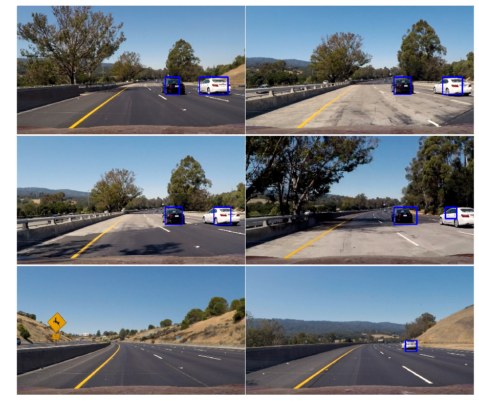

##Writeup Template
###You can use this file as a template for your writeup if you want to submit it as a markdown file, but feel free to use some other method and submit a pdf if you prefer.

---

**Vehicle Detection Project**

The goals / steps of this project are the following:

* Perform a Histogram of Oriented Gradients (HOG) feature extraction on a labeled training set of images and train a classifier Linear SVM classifier
* Optionally, you can also apply a color transform and append binned color features, as well as histograms of color, to your HOG feature vector. 
* Note: for those first two steps don't forget to normalize your features and randomize a selection for training and testing.
* Implement a sliding-window technique and use your trained classifier to search for vehicles in images.
* Run your pipeline on a video stream (start with the test_video.mp4 and later implement on full project_video.mp4) and create a heat map of recurring detections frame by frame to reject outliers and follow detected vehicles.
* Estimate a bounding box for vehicles detected.

## [Rubric](https://review.udacity.com/#!/rubrics/513/view) Points
###Here I will consider the rubric points individually and describe how I addressed each point in my implementation.  

---
###Writeup / README

####1. Provide a Writeup / README that includes all the rubric points and how you addressed each one.  You can submit your writeup as markdown or pdf.  [Here](https://github.com/udacity/CarND-Vehicle-Detection/blob/master/writeup_template.md) is a template writeup for this project you can use as a guide and a starting point.  

You're reading it!

###Histogram of Oriented Gradients (HOG)

####1. Explain how (and identify where in your code) you extracted HOG features from the training images.

The code for this step is contained in the `get_hog_features()` function present in `util.py` (lines 18-35)

I started by reading in all the `vehicle` and `non-vehicle` images.  Here is an example of one of each of the `vehicle` and `non-vehicle` classes:

I then explored different color spaces and different `skimage.hog()` parameters (`orientations`, `pixels_per_cell`, and `cells_per_block`).  
Here is an example using the `RGB` color space and HOG parameters of `orientations=9`, `pixels_per_cell=(8, 8)` and `cells_per_block=(8, 8)`:

####2. Explain how you settled on your final choice of HOG parameters.

I tried various combinations of parameters for `hog()` function. I tried the parameters based on the accuracy of SVM classifier. In the end I settled on `YUV` color space with `orientations=11`, `pixels_per_cell=(16, 16)` and `cells_per_block=(2, 2)`

####3. Describe how (and identify where in your code) you trained a classifier using your selected HOG features (and color features if you used them).

I trained a linear SVM using only the HOG features. I experimented with color and spatial features also, but they were making less accurate prediction than only hog features. Also, the number of parameters were very large when using color and spatial features.

Training code is present in `train.py` file. After reading vehicle and non-vehicles images, I split them in training/test dataset using skelearn `train_test_split()` function. After that I trained SVC with different values of C to find the best classifier.

Since I am only using HOG features I didn't scaled the feature vector.

###Sliding Window Search

####1. Describe how (and identify where in your code) you implemented a sliding window search.  How did you decide what scales to search and how much to overlap windows?

Sliding window search functionality is implemented in `sliding_window_search` method present in `util.py` lines 86-166. For each image subsection, first I extract HOG features for whole subsection and then select HOG features for each window from extracted features. After extracting HOG features I run it through SVM classifier to predict whether car is present in the image or not. 

For window subsections I iterate over the different regions of the image with varying (x,y) scales. Dimension and scales are mentioned in 232-233 in `util.py`.
Instead of configuring overlap ratio between windows I am using 2 cells per step to derive the overlap. 

####2. Show some examples of test images to demonstrate how your pipeline is working.  What did you do to optimize the performance of your classifier?

Complete pipeline is present in the `pipeline()` method in `util.py` lines 227-259.

Following steps are present in the pipeline

1. Iterate over image subsections to get sliding window regions
2. Classify each sliding window as vehicle or non-vehicle
3. Add intensity to pixels belonging to sliding window with vehicle
4. Based on a threshold value of 1 ignore regions with low intesity values.
5. Connect windows based on proximity.
6. Mark final windows with vehicles.

I tested various colorspaces for the image classification. `YUV` channel worked best. I modified code to use all the channels for HOG features. Also, increasing the `pixels_per_cell` increased classification speed.

Images with bounding boxes

### Video Implementation

####1. Provide a link to your final video output.  Your pipeline should perform reasonably well on the entire project video (somewhat wobbly or unstable bounding boxes are ok as long as you are identifying the vehicles most of the time with minimal false positives.)
Here's a [link to my video result](./output_project_video.mp4)

####2. Describe how (and identify where in your code) you implemented some kind of filter for false positives and some method for combining overlapping bounding boxes.

Video processing pipeline is same as single image processing pipeling with one difference. I save the state of past 20 matched windows from previous frame and add them to the current window. Then, I use half the number of windows present as a threshold. This reduces the rate of false positive.

I added a class `Vehicles` in `util.py` to maintain the state of previous selected windows.

---

###Discussion

####1. Briefly discuss any problems / issues you faced in your implementation of this project.  Where will your pipeline likely fail?  What could you do to make it more robust?

Following are the main issue that I faced

1. Accuracy of classifier: The accuracy of the classifer was very less when I was using only GITTI_extraced images for vehicles. It increased significantly after adding all the dataset that was available. Adding color and spatial features increased the accuracy on test dataset, but I was getting lot of false positives. False positives decreasd after removing color/spatial features. Adding normalization decreased the accuracy of classifier. 

2. False positives: It was difficult find the correct sliding window section that would find car images without false positive. After lot of experimentation I was able find good sliding window sizes. Also adding `Vehicles` class reduced the number of false positives.

The pipeline fails when two vehicle a very close together. Pipelines joins the area of two vechiles and classify both as part of single vehicle. Also it needs to see complete vehicle before it can classify it.

Improvements that can be made.

* Use a better classifier like CNN for vehicle classification
* Instead of using hand crafted window sizes classifier should calculate window sizes. 
* More vehicle training examples collected in different weather/light conditions.    